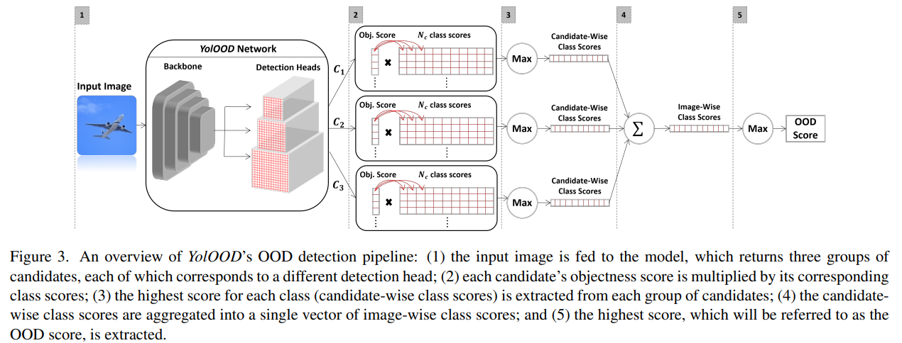

# YolOOD: Utilizing Object Detection Concepts for Multi-Label Out-of-Distribution Detection

This is a PyTorch implementation of [YolOOD: Utilizing Object Detection Concepts for Multi-Label Out-of-Distribution Detection](https://arxiv.org/pdf/2212.02081) by Alon Zolfi, Guy Amit, Amit Baras, Satoru Koda, Ikuya Morikawa, Yuval Elovici, Asaf Shabtai. Code is modified from [YOLOv5](https://github.com/ultralytics/yolov5) and [JointEnergy](https://github.com/deeplearning-wisc/multi-label-ood).



## Installation
```bash
conda create -n YolOOD python=3.8
conda install pytorch==1.11.0 torchvision==0.12.0 torchaudio==0.11.0 cudatoolkit=11.3 -c pytorch
pip install opencv-python==4.6.0.66
pip install pyyaml==6.0
pip install scikit-learn==1.1.1
pip install seaborn==0.11.2
pip install tqdm==4.64.0
pip install albumentations==1.1.0
```

## Datasets
### In-distribution
In-distribution datasets should be formatted in the following format (YOLO format):
```
├── dataset_name
│   ├── images
│   │   ├── train
│   │   │   ├── file1.png
│   │   │   ├── ...
│   │   ├── val
│   │   │   ├── ...
│   │   ├── test
│   │   │   ├── ...
│   ├── labels
│   │   ├── train
│   │   │   ├── file1.txt
│   │   │   ├── ...
│   │   ├── val
│   │   │   ├── ...
```
Each image in the train and validation folders should have a corresponding label file. Every line (an object) in the labels file should be formatted as:

```class_id x_center y_center width height```

where x_center, y_center, width, and height are normalized between [0,1].
train and val folders are used to train the model (YolOOD or YOLO-cls), while test is used as in-distribution dataset for the OOD detection evaluation.

For simplicity, for each dataset, we include the lists containing all the file names for each split named {split}.list .

### OOD
OOD datasets should be formatted in the following format:
```
├── dataset_name
│   ├── images
│   │   ├── test
│   │   │   ├── file1.png
│   │   │   ├── ...
```
Note: there is no labels folder since the images are only used for the OOD detection evaluation.

### Download datasets

By default, the script removes all temporary files and folders. To override this setting, remove ```--delete_temp``` option.

#### COCO 

To download COCO dataset, run the following script:

```bash
python datasets/download_datasets.py --dataset_name coco2017 --delete_temp
```

#### Pascal VOC

To download Pascal VOC dataset, first download the test data 2012 version from [here](http://host.robots.ox.ac.uk/pascal/VOC/voc2012/) (register to the website, then go to Contents/Test Data -> Submission of Results/PASCAL VOC Evaluation Server -> PASCAL Visual Object Classes Challenge 2012 (VOC2012) -> Download VOC2012 test data) and place the download tar file (named download.tar) in the [datasets/pascal_voc](datasets/pascal_voc) folder.
Then run the following script:

```bash
python datasets/download_datasets.py --dataset_name pascal_voc --delete_temp
```

#### Objects365_in and Objects365_out
Since the original Objects365 dataset is extremely large (712 GB = 367G data + 345G zips), the following script prepares both in-distribution and OOD subsets.
Download the custom labels from [here](https://drive.google.com/file/d/1LXdLqAYGR7G83nskc96AXpOfyKy2tQLN/view?usp=drive_link) and place them in the [datasets/objects365_in](datasets/objects365_in) folder.
```bash
python datasets/download_datasets.py --dataset_name objects365 --delete_temp
```
Note: this script requires large disk space to download the entire Objects365 dataset.
After the dataset preparation is done, the temporary folders and files are deleted.

For Objects365_in, the mapping from the original Objects365 is:
{0: 0, 1: 2, 2: 5, 3: 21, 4: 56, 5: 24, 6: 72, 7: 8, 8: 25, 9: 10, 10: 13, 11: 92, 12: 55, 13: 116, 14: 39, 15: 96, 16: 114, 17: 139, 18: 65, 19: 78}

the class names are: [ person, chair, car, boat, wild bird, bench, sailboat, bottle, potted plant, cup,
         handbag, dog, bus, train, umbrella, cow, airplane, cat, truck, horse]
#### NUS-WIDE_out

To download NUS-WIDE_out subset, run the following script:

```bash
python datasets/download_datasets.py --dataset_name nus_wide_out
```

## Models

### Pretrained Models

The pretrained models (YolOOD, YOLO-cls, and YOLO) for each in-distribution dataset can be found [here](https://drive.google.com/file/d/1OtpkZzjFjSTxpS4qTuZwM25j8x66zZek/view?usp=drive_link).
Unzip the downloaded zip file in the project's root folder.

### Train Models

#### YolOOD

Train YolOOD on COCO:
```bash
python train_yolood.py --data data/coco2017.yaml
```
Train YolOOD on Pascal VOC:
```bash
python train_yolood.py --data data/pascal_voc.yaml
```
Train YolOOD on Objects365_in:
```bash
python train_yolood.py --data data/objects365_in.yaml
```

experiments will be saved in the runs/train_yolood folder.

#### YOLO-cls
Train YOLO-cls on COCO:
```bash
python train_cls.py --ind_dataset coco2017
```
Train YolOOD on Pascal VOC:
```bash
python train_cls.py --ind_dataset pascal_voc
```
Train YolOOD on Objects365_in:
```bash
python train_cls.py --ind_dataset objects365_in
```

experiments will be saved in the runs/train_cls folder.

## OOD Evaluation
The given scripts use for example the COCO as in-distribution dataset and Objects365_out as OOD dataset.

### Evaluate YolOOD:
```bash
python eval_ood.py --arch yolo_ood --load_model PATH_TO_MODEL_FOLDER --ood yolood --method max --ood_type obj*cls --head_method sum --ind_dataset coco2017 --ood_dataset objects365_out  
```
Optional arguments:
```bash
--ood ['yolood', 'energy'] 
--method ['max', 'sum'] # class scores aggregation method
--ood_type ['obj*cls', 'obj', 'cls'] # which candidate scores to use
--head_method ['max', 'sum', 'multiply'] # head aggregation method
```

### Evaluate YOLO-cls:

JointEnergy:
```bash
python eval_ood.py --arch yolo_cls --load_model PATH_TO_MODEL_FOLDER --ood energy --method sum --ind_dataset coco2017 --ood_dataset objects365_out
```

MSP:
```bash
python eval_ood.py --arch yolo_cls --load_model PATH_TO_MODEL_FOLDER --ood msp --method max --ind_dataset coco2017 --ood_dataset objects365_out
```

MaxLogit:
```bash
python eval_ood.py --arch yolo_cls --load_model PATH_TO_MODEL_FOLDER --ood logit --method max --ind_dataset coco2017 --ood_dataset objects365_out
```

ODIN:

ODIN contains the temperature (defaults to 1) and noise magnitude (defaults to 0) hyperparams.
```bash
python eval_ood.py --arch yolo_cls --load_model PATH_TO_MODEL_FOLDER --ood odin --method max --T 1 --noise 0 --ind_dataset coco2017 --ood_dataset objects365_out
```

To find the best hyperparams run the following script and choose the configuration the yields the best FPR95:
```bash
python fine_tune_ood.py --ood odin --method max --noise NOISE_VALUE --T TEMPERATURE_VALUE --ind_dataset coco2017 --load_model PATH_TO_MODEL_FOLDER
```

Mahalanobis:

Mahalanobis contains the noise magnitude (defaults to 0) feature ensemble option (vanilla/ensemble) hyperparams.
```bash
python eval_ood.py --arch yolo_cls --load_model PATH_TO_MODEL_FOLDER --ood odin --method max --noise 0 --maha_type ensemble --ind_dataset coco2017 --ood_dataset objects365_out
```

To find the best hyperparams run the following script and choose the configuration the yields the best FPR95:
```bash
python fine_tune_ood.py --ood maha --method max --maha_type ensemble --noise NOISE_VALUE --ind_dataset coco2017 --load_model PATH_TO_MODEL_FOLDER
```

### Evaluate YOLO (Object detector):
```bash
python eval_ood.py --arch yolo --load_model PATH_TO_MODEL_FOLDER --ood yolo --method max --ood_type obj*cls --head_method max --ind_dataset coco2017 --ood_dataset objects365_out
```

## Citation
```bibtex
@inproceedings{zolfi2024yolood,
  title={YolOOD: Utilizing Object Detection Concepts for Multi-Label Out-of-Distribution Detection},
  author={Zolfi, Alon and Amit, Guy and Baras, Amit and Koda, Satoru and Morikawa, Ikuya and Elovici, Yuval and Shabtai, Asaf},
  booktitle={Proceedings of the IEEE/CVF Conference on Computer Vision and Pattern Recognition},
  pages={5788--5797},
  year={2024}
}
```
